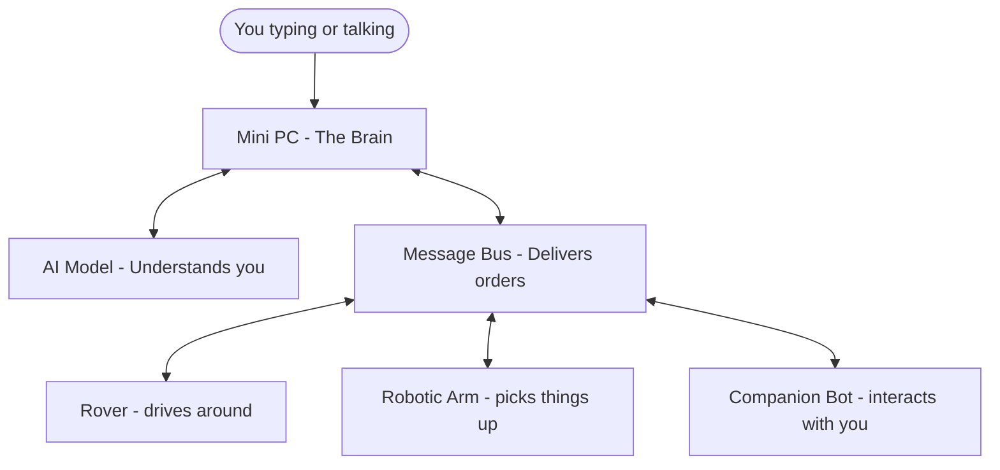
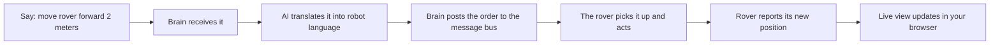
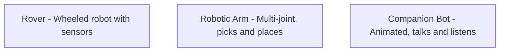

# CRCS — what is it, in plain English?

**CRCS stands for Centralized Robotic Control System.**

I'm building a system where one mini computer acts as the brain for a bunch of robots. Instead of each robot being its own isolated project, they all connect back to a central master that coordinates everything.

Think of it like a smart home hub, but for robots. You give it commands in normal English, and it figures out which robot should do what.

## The big picture



Notice the arrows go both ways. Robots don't just take orders, they report back: "I'm moving", "I'm done", "I'm at this position." The brain knows the state of the entire fleet at any moment.

## Why bother?

Right now each robot lives in its own world. The robotic arm doesn't know the rover exists. One robot can't tell another to do something. By giving them a shared brain, they can work together and be controlled from one place, even from a phone.

## How a command actually flows



Behind the scenes the AI converts plain English into something like:

```json
{
  "robot": "rover",
  "action": "move",
  "parameters": { "distance": 2 }
}
```

Robots cannot understand "move forward a bit." They need exact numbers. The AI is the translator.

## The message bus, explained simply

Imagine a public bulletin board. The brain pins notes on it like "rover, drive forward 2 meters." Each robot only reads notes addressed to it. After they act, robots pin their own notes back saying "done, I'm now at position X." Everyone sees everything that's happening, but only acts on what's relevant to them.

This pattern is how CRCS can grow. Add a new robot? It just starts reading the bulletin board. No rewiring needed.

## The live view

Send a command and watch the rover actually move on a grid in your browser. Position and heading update in real-time as the robot reports back. This is built using WebSockets, which is just a way for the browser to keep an open phone line to the brain so it gets updates the instant they happen.

The same pattern will work when real robots are connected. The brain doesn't care if the rover is a simulation or a real one with wheels. As long as it speaks the same language on the message bus, the live view shows it moving.

## The robots (examples)



Each is a separate project on different hardware. Some run on tiny microcontrollers, some on full Linux computers. CRCS is what makes them feel like one system.

## What CRCS can do today

- Understand commands written in normal English
- Convert them into structured robot instructions using a local AI model (no internet needed)
- Post commands to a message bus that any robot can listen to
- Receive status reports back from robots, including position
- Show a live 2D view in your browser where you can watch a robot move as commands run
- Be reached from a phone anywhere in the world, privately, through a secure tunnel

## What's next

- More example robots (arm, companion bot)
- Hook up real hardware one robot at a time
- Voice control so you can just talk
- Let robots talk to each other (one finishes a task, hands off to another)
- A 3D showcase view for demos

## The fun part

CRCS is a learning project to get hands-on with embedded systems, robotics, AI, and distributed computing all at once. Every commit is me figuring something new out, in public.