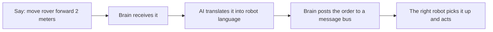
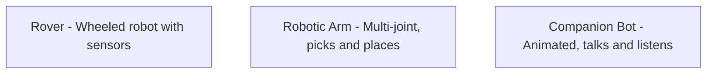

# CRCS — what is it, in plain English?

**CRCS stands for Centralized Robotic Control System.**

I'm building a system where one mini computer acts as the brain for a bunch of robots. Instead of each robot being its own isolated project, they all connect back to a central master that coordinates everything.

Think of it like a smart home hub, but for robots.

## The big picture


## Why bother?

Right now each robot lives in its own world. The robotic arm doesn't know the rover exists. One robot can't tell another to do something. By giving them a shared brain, they can work together and be controlled from one place, even from a phone.

## How a command actually flows



Behind the scenes the AI converts plain English into something like:

```json
{
  "robot": "rover",
  "action": "move",
  "parameters": { "distance": 2, "unit": "meters" }
}
```

Robots cannot understand "move forward a bit." They need exact numbers. The AI is the translator.

## The message bus, explained simply

Imagine a public bulletin board. The brain pins notes on it like "rover, drive forward 2 meters." Each robot only reads notes addressed to it. New robots can join the system just by checking the bulletin board, no rewiring needed. This is how CRCS can grow without getting messy.

## The robots (examples)



Each is a separate project on different hardware. Some run on tiny microcontrollers, some on full Linux computers. CRCS is what makes them feel like one system.

## What CRCS can do today

- Understand commands written in normal English
- Convert them into structured robot instructions using a local AI model (no internet needed)
- Post commands to a message bus that any robot can listen to
- Show a simple web page where you can type commands and see what the AI understood
- Be reached from a phone anywhere in the world, privately, through a secure tunnel

## What's next

- Hook up the actual robots one by one and have them listen to the bus
- Let robots send updates back ("done", "stuck", "battery low")
- Add voice control so you can just talk
- Let robots talk to each other (one finishes a task, hands off to another)

## The fun part

CRCS is a learning project to get hands-on with embedded systems, robotics, AI, and distributed computing all at once. Every commit is me figuring something new out, in public.